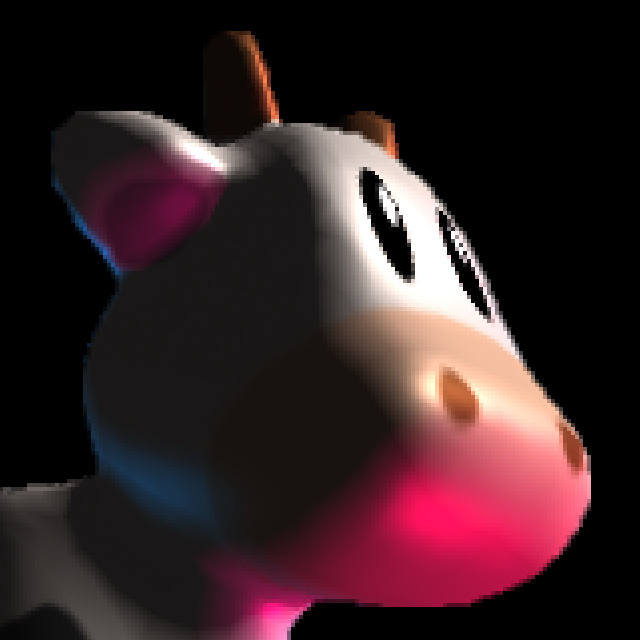

# Soft Renderer

This is a Tiny Renderer on CPU with single-thread built from scratch, using OpenGL-like API design.

- Meanwhile, this project also serve as practice while learning the book 'Real-Time Rendering' :book: https://www.realtimerendering.com/

- This project took a lot reference from project https://github.com/zauonlok/renderer for platform deploying.

## Planned Features

I intend to implement a shader-based renderer that runs on CPU from scratch using c++ with minimum dependencies. It's APIs are similar to OpenGL, with the following features:

- Pipeline that runs on CPU (maybe GPU later, but more limited platforms)
- Programable and Extendable Shaders
- Flexible and Fast to Access Buffers
- API similar to OpenGL
- Support Cross Platform (MacOS, Windows)
- Image and Geometry Process Functionalities

### Shader-based pipeline

A simple example for creating a shader
```c++
class ExampleShader : public Shader
{
public:
    virtual v2f vert(const vdata in, const Entity * entity, const Scene & scene) const;
    virtual vec4 frag(const v2f in, const Entity * entity, const Scene & scene) const;
};

v2f ExampleShader::vert(const vdata in, const Entity * entity, const Scene & scene) const
{
    v2f out;

    out.position = MVP_MATRIX * vec4(in.position, 1.0f);
    out.texcoord = in.texcoord;
    out.normal   = MODEL_INV_TRANSPOSE * in.normal;

    return out;
}

vec4 ExampleShader::frag(const v2f in, const Entity * entity, const Scene & scene) const
{
    rgb color = rgb(
        in.normal.x * 0.5f + 0.5f,
        in.normal.y * 0.5f + 0.5f,
        in.normal.z * 0.5f + 0.5f );
    
    return vec4(color.normalized(), 1.0f);
}
```

### MSAA

With MSAA    |  Without MSAA
:-------------------------:|:-------------------------:
  |  
13 FPS | 25 FPS

### Switch Shading & Mouse Manipulation


Triangle Normal Shading    |  Vertex Normal Shading
:-------------------------:|:-------------------------:
  |  
  |  

## Todos

- [x] Basic Math Liberary
- [x] Basic Resource IO (.obj, .bmp)
- [x] Basic Rasterization Implementation
- [x] Basic Graphics Pipeline that runs on single thread
- [x] Win32 Application API
- [x] Simple Shaders (Unlit, VertexNormal, TriangleNormal)
- [x] Hovering Camera by Mouse Drag
- [x] Implement Barycentric Triangle Rastrization with Perspective Correction Interpolation
- [x] Wireframe Display
- [x] Multisample anti-aliasing
- [ ] Normal Mapping
- [ ] Read .mtl for Material
- [x] Basic Lighting + Phong, Blinn Shaders
- [ ] Mipmapping
- [ ] Sky Box + Environment Map
- [ ] PBR
- [ ] PostProcessing Pass
- [ ] Alpha Test + Alpha Blending
- [ ] Multi-thread

## Current Features

- basic linear algebra
  - vector
  - quaternion
  - matrix

- IO
  - BMP Format
  - OBJ Format

- Graphics
  - basic rasterization algorithm
  - colormap
  - digit display
  - programable shader
  - MSAA

- Others
  - dynamic array
  - quick sort

## Current Platform

MacOS (Cocoa App)

Windows (Win32 App)

## Compile & Run

### MacOS

- compile

```zsh
make macos
```

- run

```zsh
./viewer
```

### Windows 

- compile

```shell
mingw32-make win32
```

- run

```shell
viewer
```
