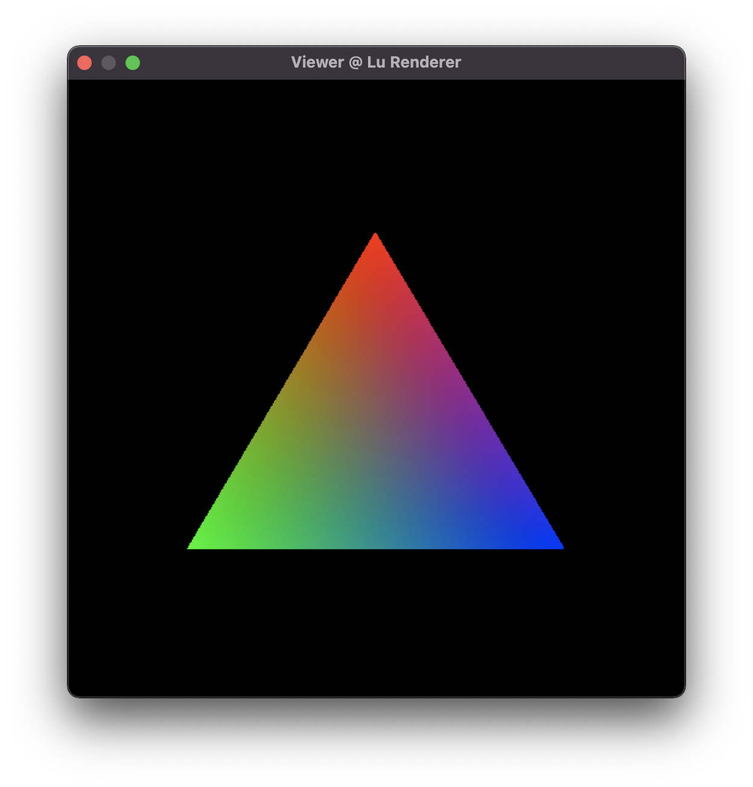

# Lu Renderer

A Tiny Renderer designed to rely on minimum dependencies

> dependencies:  `stdlib.h`   `stdio.h`   `math.h`   `string.h`   `assert.h`



### Content

- basic linear algebra

  - vector
  - quaternion
  - matrix

- IO
  - BMP Format

  - OBJ Format

- Graphics
  - basic rasterization algorithm

- Others

  - dynamic array

### Platform Support

- MacOS

### Compile & Run

#### MacOS

```shell
## for test run
make
## for viewer application
make mac
## run program
./viewer
```

#### Windows

```shell
mingw32-make
```

then click **viewer.exe** and run
