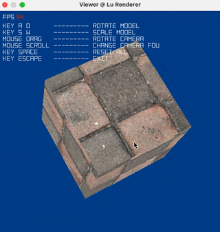

# Lu Renderer (Under Developement)

A Tiny Renderer designed to rely on minimum dependencies (basically with standard C library) with software rasterization

:construction: **currently under construction** :construction:

Meanwhile, this project also serve as practice while learning the book 'Real-Time Rendering' :book:

## Planned Features

I intend to implement a shader-based renderer that runs on CPU from scratch using c++ with minimum dependencies. It's APIs are similar to OpenGL, with the following features:

- Pipeline that runs on CPU (maybe GPU later, but more limited platforms)
- Programable and Extendable Shaders
- Flexible and Fast to Access Buffers
- API similar to OpenGL
- Support Cross Platform (MacOS, Windows)
- Image and Geometry Process Functionalities

### Wire Frame Display

 

### Unlit Shading & Mouse Manipulation



Triangle Normal Shading    |  Vertex Normal Shading
:-------------------------:|:-------------------------:
  |  
  |  

## Todos

- [x] Basic Math Liberary
- [x] Basic Resource IO (.obj, .bmp)
- [x] Basic Rasterization Implementation
- [x] Basic Graphics Pipeline that runs on single thread
- [x] Win32 Application API
- [x] Simple Shaders (Unlit, VertexNormal, TriangleNormal)
- [x] Hovering Camera by Mouse Drag
- [ ] Normal Mapping
- [ ] Basic Lighting + Phong, Blinn Shaders
- [ ] Different Texture Sampling Filtering Method
- [ ] Sky Box + Environment Map
- [ ] PBR
- [ ] PostProcessing Pass
- [ ] Alpha Test + Alpha Blending
- [ ] Multi-thread

## Bug Report

- Unlit Shader get segmentation fault when no albedo texture is provided
- Win32 platform is likely to freeze when handling input and when the window is moving

## Current Features

- basic linear algebra
  - vector
  - quaternion
  - matrix

- IO
  - BMP Format
  - OBJ Format

- Graphics
  - basic rasterization algorithm
  - colormap
  - digit display
  - easy programable shader

- Others
  - dynamic array
  - quick sort

## Current Platform

MacOS (Cocoa App)

Windows (Win32 App)

## Compile & Run

### MacOS

- compile

```zsh
make macos
```

- run

```zsh
./viewer
```

#### Windows 

- compile

```shell
mingw32-make win32
```

- run

```shell
viewer
```
