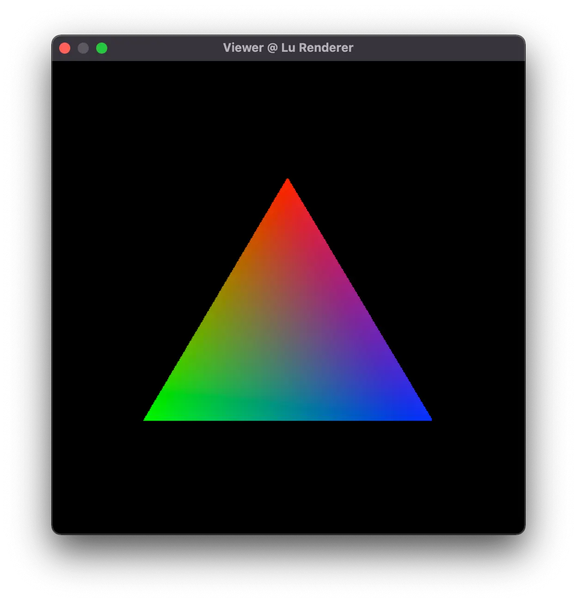

# Lu Renderer

A Tiny Renderer designed to rely on minimum dependencies

Meanwhile, this project also serve as practice while learning the book 'Real-Time Rendering'

I intend to implement a shader-based renderer that runs on CPU from scratch using c++ with minimum dependencies. It's API is similar to OpenGL, with the following features:

- Programable Shaders
- Array Buffer, Frame Buffer and Element Buffer
- Fixed Pipeline in clipping and Screen mapping
- Multi Platform

> dependencies:  `stdlib.h`   `stdio.h`   `math.h`   `string.h`   `assert.h`   `utility`




### Content

- basic linear algebra
  - vector
  - quaternion
  - matrix

- IO
  - BMP Format
  - OBJ Format

- Graphics
  - basic rasterization algorithm
  - colormap

- Others
  - dynamic array

### Platform Support

- MacOS

### Compile & Run

#### MacOS

```shell
## for test run
make
## for viewer application
make mac
## compile core dll
make dll
## run program
./viewer
```

#### Windows

```shell
mingw32-make
```

then click **viewer.exe** and run
