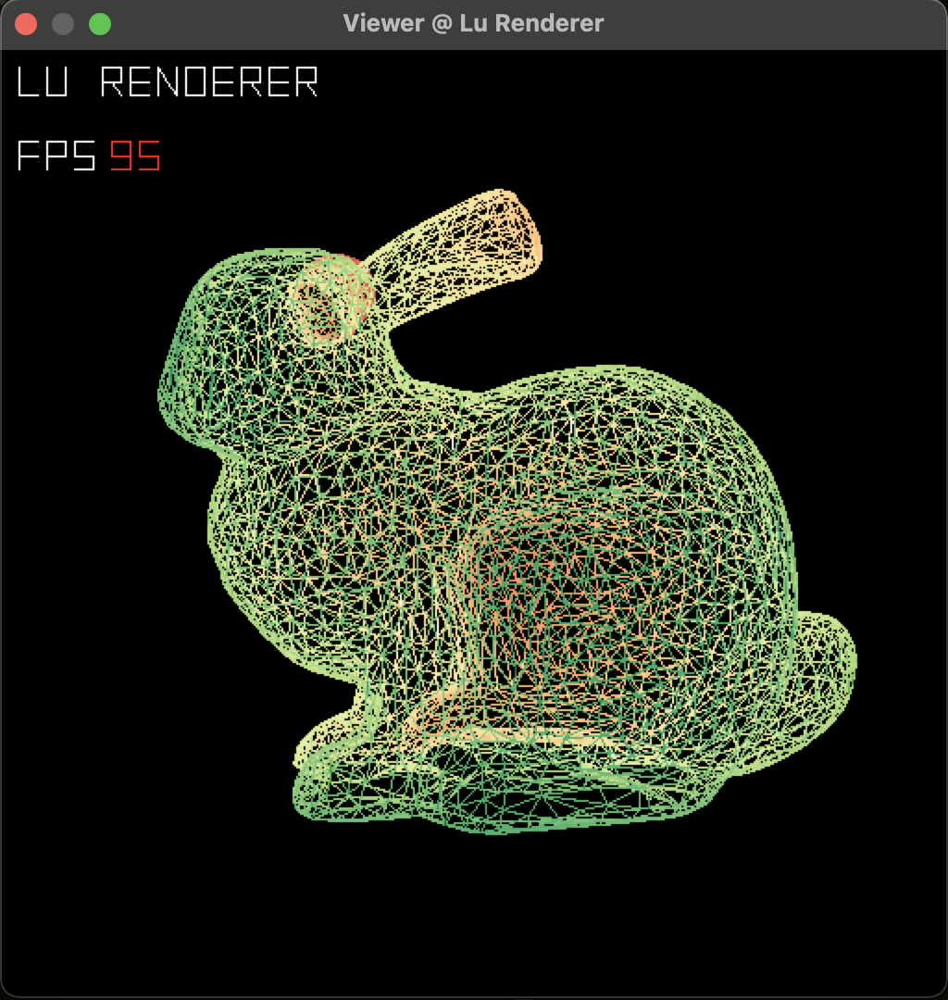

# Lu Renderer (Under Developement)

A Tiny Renderer designed to rely on minimum dependencies (basically with standard C library)

:construction: **currently under construction** :construction:

Meanwhile, this project also serve as practice while learning the book 'Real-Time Rendering' :book:

## Planned Features

I intend to implement a shader-based renderer that runs on CPU from scratch using c++ with minimum dependencies. It's APIs are similar to OpenGL, with the following features:

- Pipeline that runs on CPU (maybe GPU later, but more limited platforms)
- Programable and Extendable Shaders
- Flexible and Fast to Access Buffers
- API similar to OpenGL
- Support Cross Platform (MacOS, Windows)
- Image and Geometry Process Functionalities




## Current Features

- basic linear algebra
  - vector
  - quaternion
  - matrix

- IO
  - BMP Format
  - OBJ Format

- Graphics
  - basic rasterization algorithm
  - colormap
  - digit display
  - programable shader

- Others
  - dynamic array
  - quick sort

## Current Platform

MacOS (Cocoa App)

Windows (Win32 App)

## Compile & Run

### MacOS

- compile

```zsh
make macos
```

- run

```zsh
./viewer
```

#### Windows 

- compile

```shell
mingw32-make win32
```

- run

```shell
viewer
```
